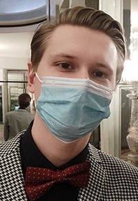

# Anton Navitski

#### Student Junior Frontend Developer

___

### Contacts:
- Location: Warsaw, Poland
- Phone: [+48 511 483 113](tel:+48511483113 "phone")
- e-mail: [navickiy1994@gmail.com](mailto:navickiy1994@gmail.com "mail")
- Netlify: [Antonowka](https://app.netlify.com/teams/navickiy1994-3-imbsy/overview "mail")
- GitHub: [Antonowka](https://github.com/Antonowka "GitHub")
- Discord: [@Shimmy#9464](https://discord.com/app "mail")

___

### My Ambitions:
By the end of 2022, you will receive the necessary amount of knowledge and skills 
sufficient for employment in the Front end development studio.
To continue my studies and at the same time to work in a field that brings me pleasure.

___

### Soft Skills:
+ Teamwork
+ GTD
+ Agile
+ Ability and striving for improvement

___

### Tech Skills:
+ Photoshop
+ HTML
+ CSS:  *Flexbox, Adaptive layout, Animation*
+ GIT
+ elementary JS: *integration into my code*

___

### Tools:
+ Photoshop
+ VSCode
+ Figma
+ Git Desktop

___
